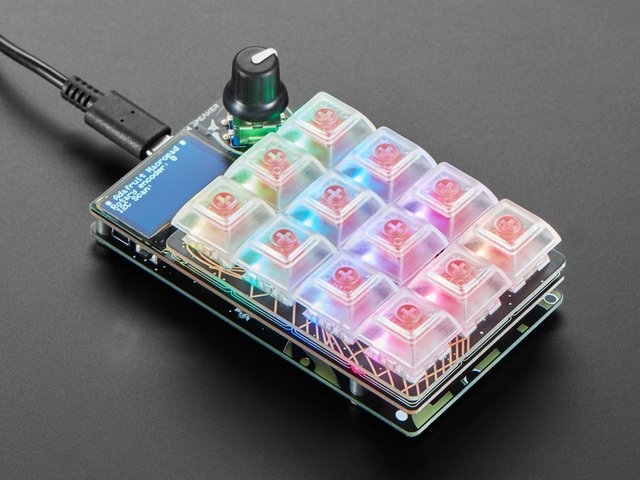

# Welcome to Adabox 19 - Macropad 

Adafruit page at [adafruit-macropad](https://learn.adafruit.com/adafruit-macropad-rp2040/overview
)

This tutorial was created to streamline setting up the Macropad
Circuitpython libraries.  Example projects are also included.

