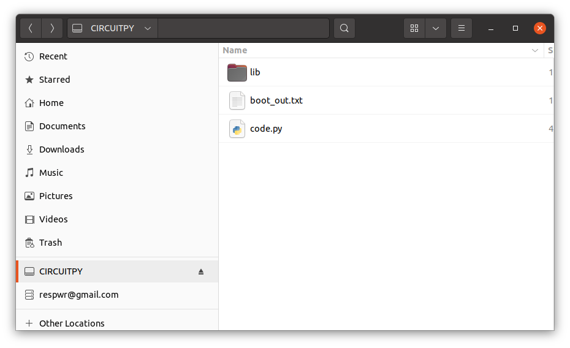
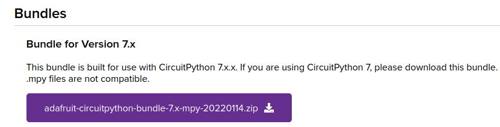
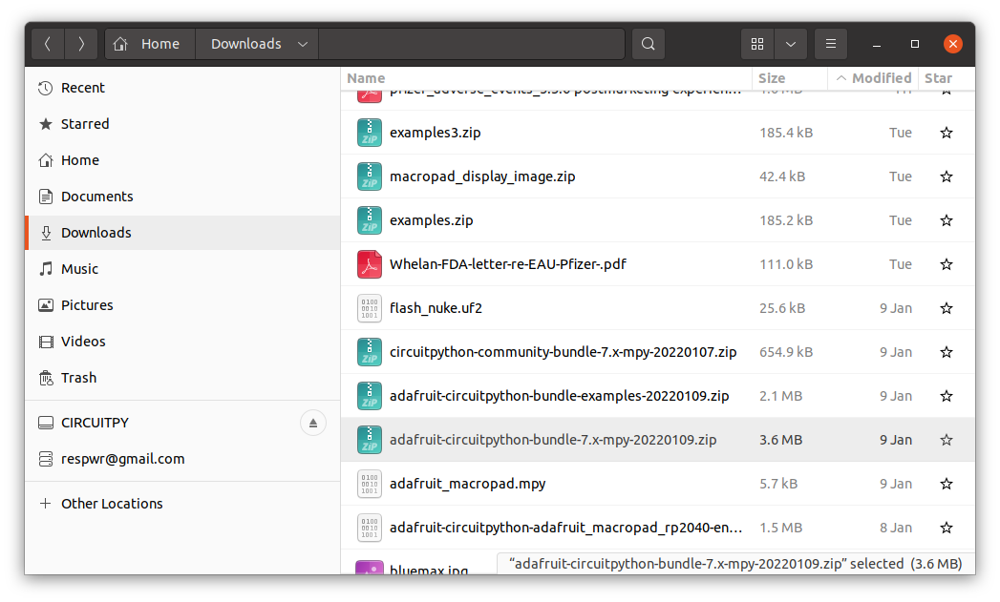
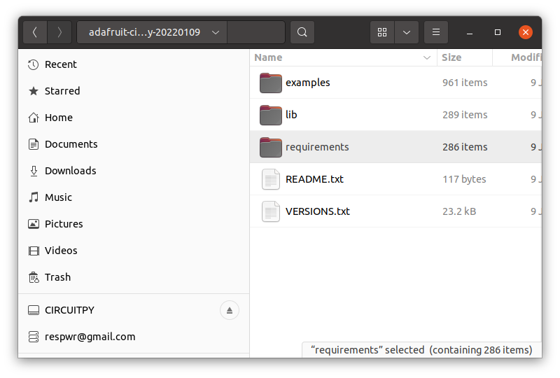
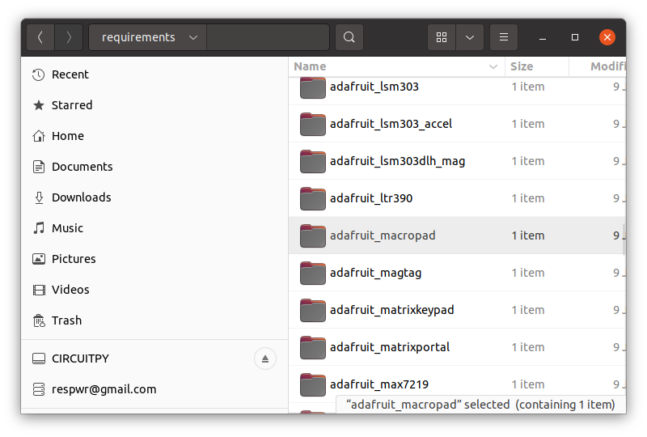
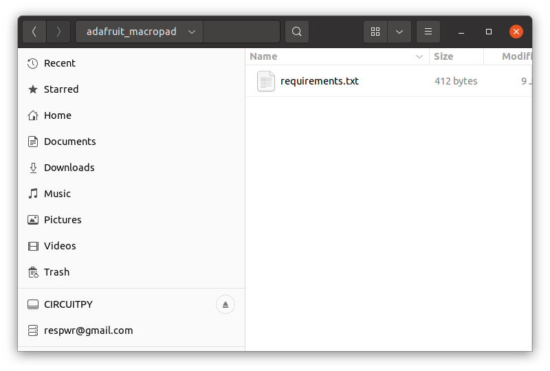
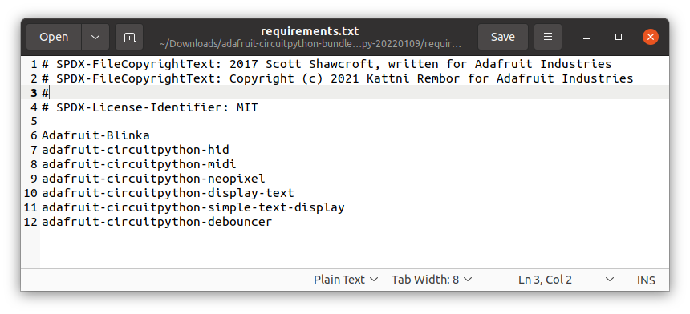
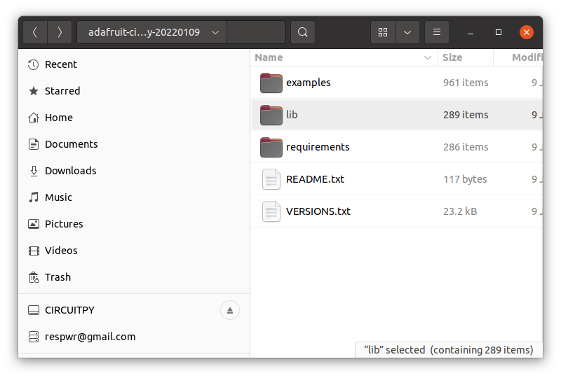
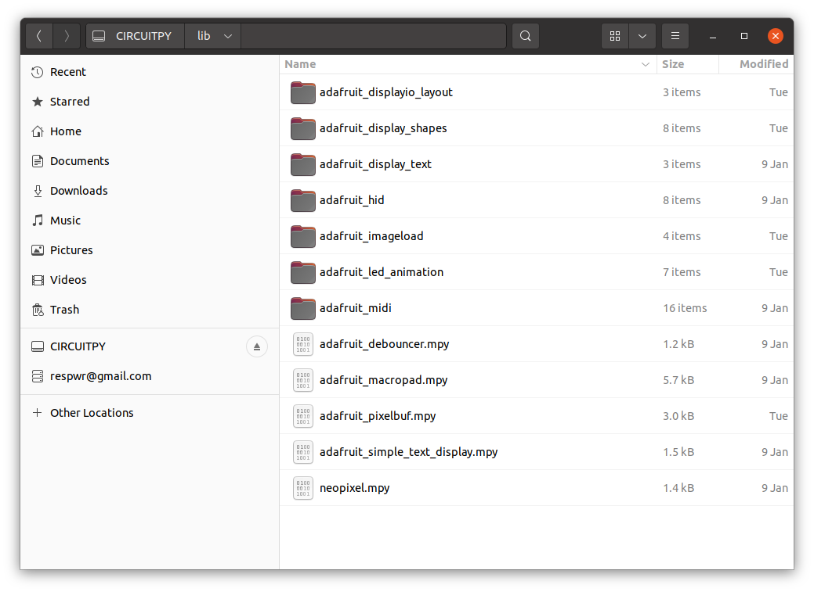

# Load Circuitpython Libraries
## &nbsp;
Adafruit combines libraries for all of their products into one huge circuit python library bundle.  You need to download this file and copy what you need onto your macropad.

## Create lib folder
On your macropad CIRCUITPY drive.  

## Download Circuitpython Bundle

[https://circuitpython.org/libraries](https://circuitpython.org/libraries)

## Open Macropad Requirements file

## Copy the libraries
listed in the requirements file from the lib folder in the circuit python bundle to the lib folder in your CIRCUITPY drive

Your CIRCUITPY lib folder should look like this

