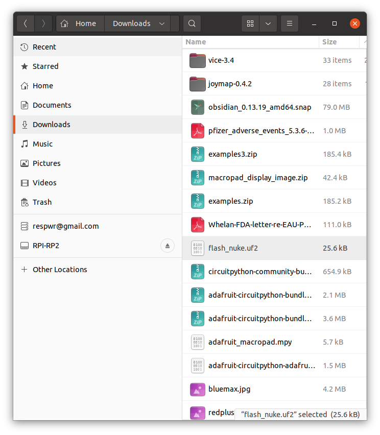

# Troubleshooting
## &nbsp;
Link to Adafruit's troubleshooting page
[https://learn.adafruit.com/adafruit-macropad-rp2040/troubleshooting](https://learn.adafruit.com/adafruit-macropad-rp2040/troubleshooting)
## Safe mode
Halts execution of python code.  See [adafruit link](https://learn.adafruit.com/adafruit-macropad-rp2040/circuitpython) for full Safe Mode description
#
1. Hold down reset button 
2. Wait 700ms for yellow flash
3. Press and release reset again
4. Should now see repeating 3 yellow flashes


## Nuke the flash
#
1. Download ["nuke" UF2 image](https://cdn-learn.adafruit.com/assets/assets/000/101/659/original/flash_nuke.uf2?1618945856)
2. Put macropad in bootloader mode (see instructions in Update CP section of this tutorial)
3. Copy UF2 image to RPI-RP2 drive


## Stuck in READ ONLY mode
#
1. Put into safe mode.
2. From Mu REPL [(see adafruit link)](https://learn.adafruit.com/adafruit-macropad-rp2040/the-repl), type 
```
import storage
storage.erase_filesystem()
```
If this doesn't work, then nuke the flash