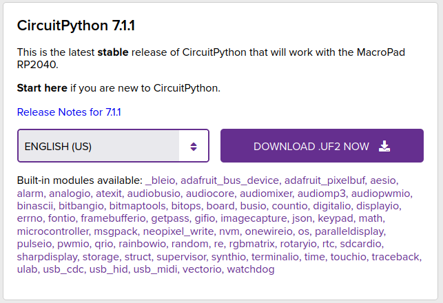
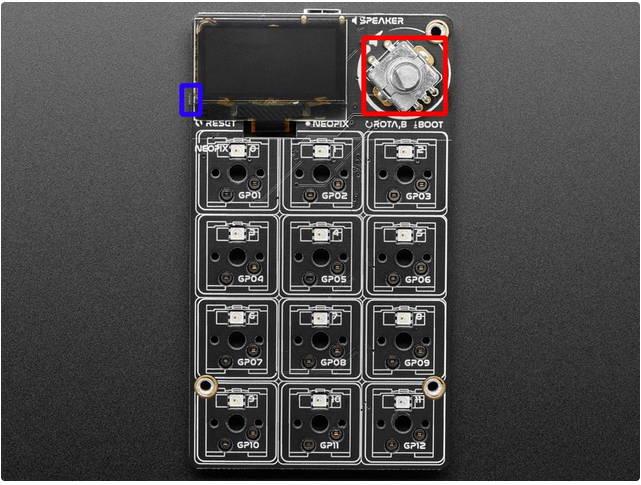
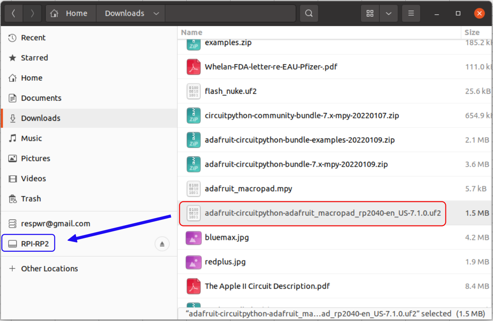
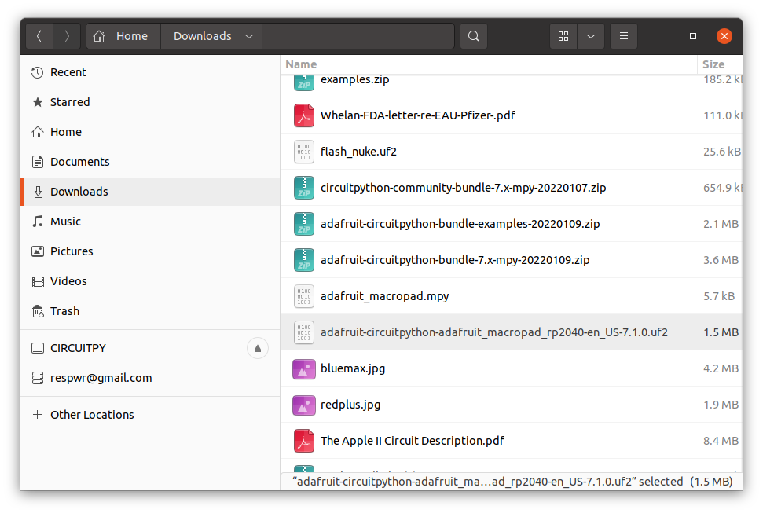

# Update Circuitpython
## &nbsp;

## Download UF2 image

[https://circuitpython.org/board/adafruit_macropad_rp2040/](https://circuitpython.org/board/adafruit_macropad_rp2040/)

## Place macropad into bootloader mode
Hold down the rotary encoder knob (red) and press and release the reset button on the side (blue)

The RPI-RP2 drive will appear in your file/folder manager.  

## Copy UF2 file to the RPI-RP2 drive

The RPI-RP2 drive will disappear and a new disk drive called CIRCUITPY will appear

